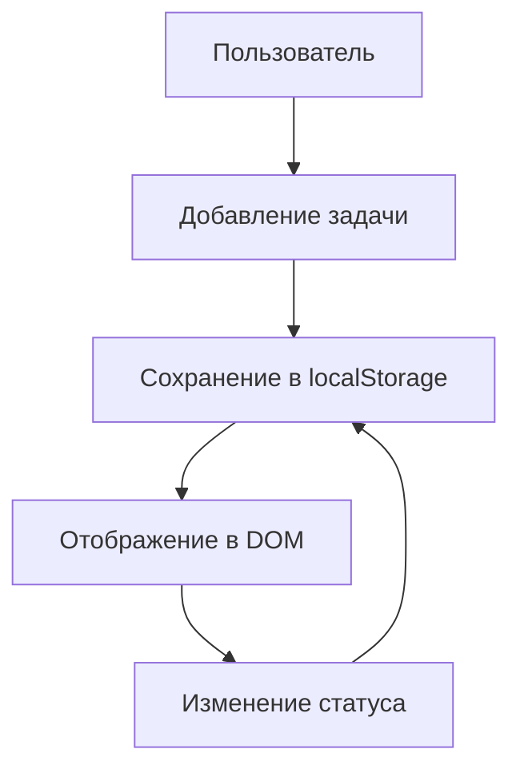

# ToDo List - Документация

## 📌 Обзор приложения

Простое и удобное приложение для управления задачами, написанное на чистом TypeScript. Позволяет создавать, отмечать выполненными и удалять задачи с сохранением состояния в localStorage.

## 🌟 Основные возможности

### 🎯 Базовый функционал

- **Управление задачами**:
  - Добавление новых задач через поле ввода
  - Отметка выполненных задач (чекбоксы)
  - Удаление ненужных задач
- **Организация**:
  - Автоматическое разделение на "Активные" и "Выполненные"
  - Сохранение состояния между сессиями (localStorage)
- **Интерфейс**:
  - Минималистичный дизайн
  - Четкое визуальное разделение статусов задач

### ⚙️ Технические особенности

- Чистый TypeScript без фреймворков
- Эффективная работа с DOM
- Типизированный код
- Интеграция с localStorage
- Модульная структура

## 🛠️ Как это работает

### 🔧 Ключевые функции

1. **`createToDoItem(text, status)`**

   - Создает элементы задач
   - Управляет состоянием чекбоксов
   - Синхронизирует DOM и хранилище

2. **`initItems()`**

   - Восстанавливает задачи из localStorage
   - Разделяет задачи по статусам

3. **Обработчики событий**
   - Реагируют на клики и изменения
   - Обеспечивают мгновенное обновление UI

## 🚀 Как использовать

1. Откройте `index.html` в браузере
2. Добавляйте задачи через поле ввода
3. Управляйте ими с помощью чекбоксов и кнопки удаления

## 🔄 Принцип работы данных

## 💡 Возможности для улучшения

- Добавление дат выполнения задач
- Категории/метки для задач
- Редактирование существующих задач
- Анимации взаимодействий
- Темная/светлая темы

## 📝 Примечание

Приложение полностью работает на клиентской стороне и не требует серверной части. Все данные хранятся в localStorage браузера.
